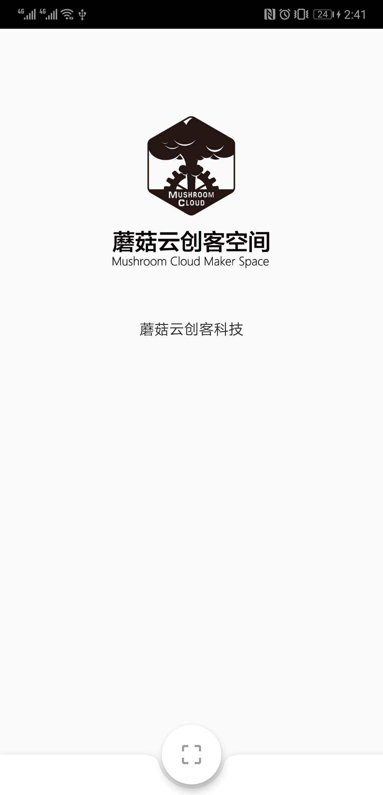

# 蘑菇云创客空间会员 APP


## 项目使用 Flutter 开发

- [官方网站](https://flutter.dev)
- [中文社区](https://flutter-io.cn)

## 待办任务

- [ ] 引导页面
- [ ] 登录页面
- [ ] 活动列表
- [ ] 活动详情
- [ ] 个人中心
- [ ] 编辑个人资料
- [ ] 艺术设计
  - [ ] LOGO
  - [ ] 界面设计

## 开发
  
- dependencies
  - flutter: version 1.7 or higher 

- clone
```
  git clone git@github.com:mushroomcloud-cc/member-app.git
  cd member-app
```

- development
```
  flutter pub get
  flutter run
```
- build
```
  # android
  flutter build apk --release
  # iOS
  flutter build ios --release
```

## Screenshots

- HomePage
- 

## 协作开发

- fork https://github.com/mushroomcloud-cc/member-app.git

