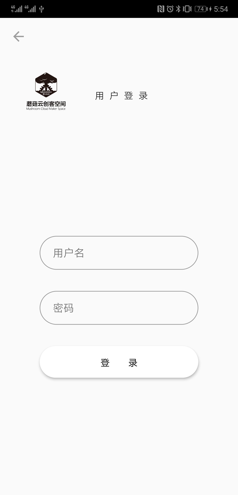
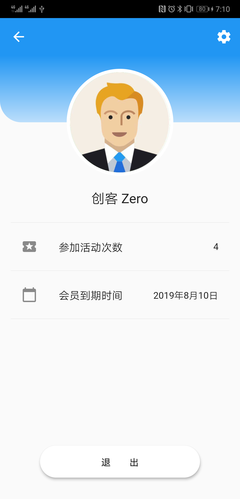

# 蘑菇云创客空间会员 APP

## 子项目
- [App 客户端](./flutter-client/README.md)
- [服务端程序](./node-server/README.md)
- [Iot 开关](./iot-switcher/README.md)

## 测试账户
- 用户名: admin 
- 密码:   12345

## 项目使用 Flutter 开发

- [官方网站](https://flutter.dev)
- [中文社区](https://flutter-io.cn)

## 待办任务

- [x] 引导页面
- [ ] 登录页面
- [ ] 活动列表
- [ ] 活动详情
- [ ] 个人中心
- [ ] 编辑个人资料
- [ ] 艺术设计
  - [ ] LOGO
  - [ ] 界面设计
- [ ] 扫描打开车间门(硬件)

## 开发
  
- dependencies
  - flutter: version 1.7 or higher 

- clone
```
  git clone git@github.com:mushroomcloud-cc/member-app.git
  cd member-app
```

- development
```
  flutter pub get
  flutter run
```
- build
```
  # android
  flutter build apk --release
  # iOS
  flutter build ios --release
```

## Screenshots

- HomePage
  
  
- LoginPage
  
  

- WorkshopPage
  
  
- ProfilePage
  
  
## 协作开发

- fork https://github.com/mushroomcloud-cc/member-app.git

## 开发问题
- Android 打包无法下载依赖
  - 解决方案一: 使用能访问*国外*服务器的网络
  - 解决方案二: 使用国内 maven 镜像，这里使用阿里云做为示例代码
  ```
  # 修改 flutter 项目下的 android/build.gradle 中的 buildscript 和 allprojects 的 repositories 部分修改如下：
  repositories {
        maven {
          url 'https://maven.aliyun.com/repository/jcenter'
        }
        maven {
          url 'https://maven.aliyun.com/repository/google'
        }
        maven {
          url 'https://maven.aliyun.com/repository/central'
        }
        maven {
          url 'https://maven.aliyun.com/repository/public'
        }
  }
  
  # 注意修改后的 android/build.gradle 请不要提交代码
  ```
